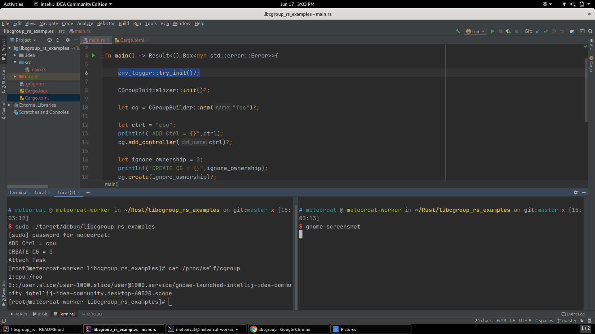

# libcgroup_rs
Rust library for managing control groups under Linux 


### Manual
* [libgroup](http://www.libcg.sourceforge.net/html)
* [cgroup_v1](https://www.kernel.org/doc/html/latest/admin-guide/cgroup-v1/)
* [cgroup_v2](https://www.kernel.org/doc/html/latest/admin-guide/cgroup-v2.html)


### Usage

#### Toml Package

```toml
[dependencies]
log = "*"
env_logger = "*"
libcgroup_rs = {version = "*"}
```


#### Rust Code

```rust
fn main()->Result<(),std::io::Error>{
    
    env_logger::try_init()?;

    // Initialize
    CGroup::init()?;
    info!("Mount Point = {:?}",CGroup::get_subsys_mount_point("cpu"));

    // create cgroup container
    let container_name = "container_test_work";
    let mut cg = CGroupBuilder::new(container_name)?;
    info!("Add Controller = {:?}",cg.add_controller("cpu")?);
    info!("Get Controller = {:?}",cg.get_controller("cpu")?);
    //cg.free_controllers();

    //only root
    cg.create(0)?;

    // execute shell
    cg.attach_task_shell()?;

    Ok(())
}
```

#### Result



> `1:cpu:/foo`
>> Resources created by CGroup are Used

